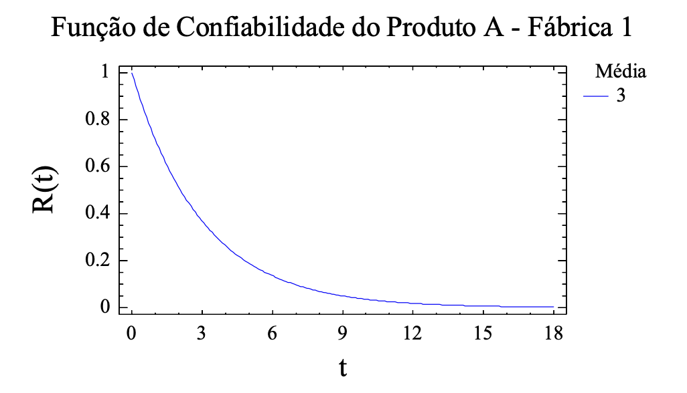
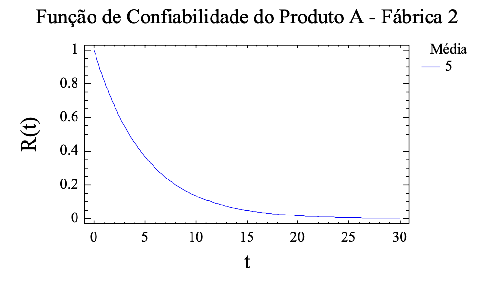
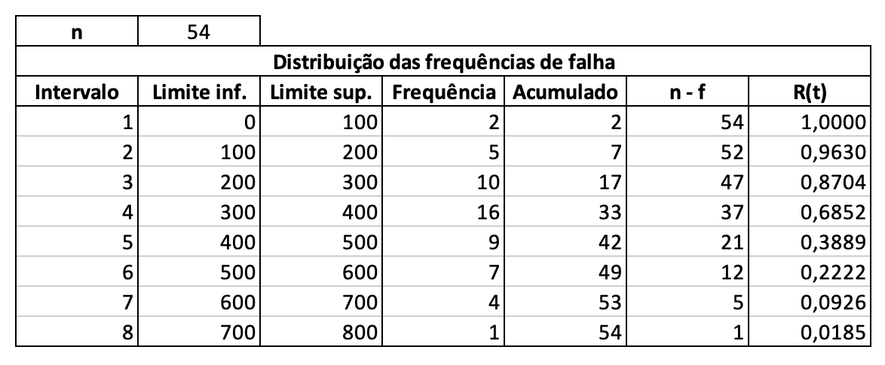
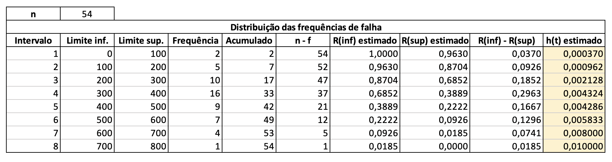

```{r setup, include=FALSE}
knitr::opts_chunk$set(echo = TRUE)
options(scipen=999)
```

```{r, message=FALSE}
library(tidyverse)
library(MASS)
library(kableExtra)
```

## Exercício 2 (página 6)
Sabe-se que em certo processo de fabricação existe uma fração de defeituosos de 1%. Se o consumidor padrão compra um lote com 50 produtos selecionados ao acaso, qual é a probabilidade de que receba no máximo 2 defeituosos?

#### Solução:
O número de defeituosos, $Y$, presente no lote tem uma distribuição binomial com parâmetros $\theta = 0.01$ e $n = 50$, $Y \sim \mathcal{b}(n, \, \theta)$. 

Então, a função de probabilidade f.p. correspondente é:

$P(Y = y) = \dbinom{n}{y} \theta^y (1 - \theta)^{n - y}, y = 0,1,2 \ldots, n$

```{r}
q = 2
n = 50
p = 0.01

pbinom(q, n, p)
```

## Exercício 3 (página 6)

Na planta do exercício anterior existe uma política de troca-livre do produto defeituoso que é comprado. Se o custo de produção é de $\text{\$}10$ u. m. e o produto é vendido por $\text{\$}15$ u. m. Qual o lucro que a planta tem por item vendido?

<br>

#### Solução:

O item é perfeito ou defeituoso. A probabilidade de defeituoso é $\theta = 0,01$.

Assim, $X \sim \mathcal{b}(n, \, \theta)$, ou seja:

$$
X=
\begin{cases}
  1 \ \text{com}\ P(X = 1) = \theta \\
  0 \ \text{com}\ P(X = 0) = 1 - \theta
\end{cases}
$$

* O custo de produção é $\text{\$}10$;

* 1% da produção é defeituosa;

* Logo, o custo de produção considerando a probabilidade de defeito é $10 \times 1,01 = \text{\$}10,10$;

* O produto é vendido por $\text{\$}15$;

* Logo, o lucro por produto vendido é $15 - 10,10 = \text{\$}4,90$.

<br>

## Exercício 4 (página 6)

Considere um sistema composto por quatro (04) componentes. Estes componentes podem ser bombas de água em um sistema de engenharia mecânica, estruturas de suporte em um sistema de engenharia civil, transformadores de estação distribuidora em um sistema de potência, microprocessadores no controle de trocadores de calor em um sistema de engenharia química, entre outros. Portanto, embora o problema seja descrito em termos de casos específicos, ele pode representar uma vasta variedade de aplicações em engenharia. Considere os componentes idênticos e com uma probabilidade de desempenho sem falha de 0,9 e, ainda, independentes. Os estados existentes para os componentes são: S (desempenho sem falhas) e F (falha).

a) Escreva a expressão do número de combinações dos estados:

#### Solução:

$(S_1 \cap S_2 \cap S_3 \cap S_4) \cup \\
(S_1 \cap S_2 \cap S_3 \cap F_4) \cup \\
(S_1 \cap S_2 \cap F_3 \cap S_4) \cup \\
(S_1 \cap S_2 \cap F_3 \cap F_4) \cup \\
(S_1 \cap F_2 \cap S_3 \cap S_4) \cup \\
(S_1 \cap F_2 \cap S_3 \cap F_4) \cup \\
(S_1 \cap F_2 \cap F_3 \cap S_4) \cup \\
(S_1 \cap F_2 \cap F_3 \cap F_4) \cup \\
(F_1 \cap S_2 \cap S_3 \cap S_4) \cup \\
(F_1 \cap S_2 \cap S_3 \cap F_4) \cup \\
(F_1 \cap S_2 \cap F_3 \cap S_4) \cup \\
(F_1 \cap S_2 \cap F_3 \cap F_4) \cup \\
(F_1 \cap F_2 \cap S_3 \cap S_4) \cup \\
(F_1 \cap F_2 \cap S_3 \cap F_4) \cup \\
(F_1 \cap F_2 \cap F_3 \cap S_4) \cup \\
(F_1 \cap F_2 \cap F_3 \cap F_4)$

<br>

b) Qual o número total de estados que o sistema pode assumir?

#### Reposta:

$S^4 +  4S^3F + 6S^2F^2 + 4SF^3 + F^4$

$1 + 4 + 6 + 4 + 1 = 16$

<br>

c) É possível escrever a expressão do item (a) como a potência de um binômio? Qual?

#### Solução:

$\sum_{k=0}^{4} \dbinom{4}{k} F^n S^{n-k}$

$\dbinom{4}{0} F^n S^{n-0} + \dbinom{4}{1} F^n S^{n-1} + \dbinom{4}{2} F^n S^{n-2} + \dbinom{4}{3} F^n S^{n-3} + \dbinom{4}{4} F^n S^{n-4}$

$S^4 +  4S^3F + 6S^2F^2 + 4SF^3 + F^4$

<br>

d) Complete a tabela adiante:

#### Solução:

| Estados do sistema | Probabilidade individual | 
| :------------- | :---------- | 
| 0 falhas | $P(S^4) = 0,9^4$| 
| 1 falha | $P(4S^3F) = 4 \times 0,9^3 \times 0,1$ | 
| 2 falhas | $P(6S^2F^2) = 6 \times 0,9^2 \times 0,1^2$| 
| 3 falhas | $P(4SF^3) = 4 \times 0,9 \times 0,1^3$ | 
| 4 falhas | $P(F^4) = 0,1^4$|

```{r}
falhas = 0:4
p_falha = 0.1
n = 4

for (x in falhas) {
  p = dbinom(x, n, p_falha)
  title = paste('Número de falhas:', x)
  lbl = paste0(title, ', probabilidade:', ' ', p)
  print(lbl)
}
```

<br>

## Exercício 5 (página 7)

No exercício 4 é assumido que quatro critérios de falha são considerados:

a) falha em um ou mais componentes derruba o sistema;

b) falha em dois ou mais componentes derruba o sistema;

c) falha em três ou mais componentes derruba o sistema;

d) falha dos quatro componentes derruba o sistema.

Então, pede-se:

1) Qual a confiabilidade, R, do sistema com o critério b?

#### Solução:

Se a falha em dois ou mais componentes derruba o sistema, isto quer dizer que o sistema suporta a falha de no máximo 1 componente, para funcionar normalmente.

A probabilidade de falha de até 1 componente pode ser expressada da seguinte forma:

$P(Y \leq 1)$

Em outras palavras, a confiabilidade do sistema é a probabilidade do sistema funcionar sem falhas:

$R = P(Y \leq 1)$

De acordo com o enunciado do exercício 4, a probabilidade de falha do sistema é de 0.1. Portanto:

$R = P[(Y=0) \cup (Y=1)]$

<hr>

$P(Y=k) = \dbinom{n}{k} S^{n-k} F^k$

$P(Y=0) = \dbinom{4}{0} 0.9^{4-0} 0.1^0$

$P(Y=0) = 0,6561$

<hr>

$P(Y=1) = \dbinom{4}{1} 0.9^{4-1} 0.1^1$

$P(Y=1) = 0,2916$

<hr>

$R = P[(Y=0) \cup (Y=1)]$

$R = 0,6561 + 0.,916$

$R = 0,6561 + 0,2916$

$R = 0,9477$

```{r}
prob_falha = 0.1
total_componentes = 4
max_componentes_falha = 1

R = pbinom(q = max_componentes_falha, size = total_componentes, prob = prob_falha)

R
```

Logo, a confiabilidade é: 

$R = 0,9477$

Que, em outras palavras, representa a probabilidade do sistema ter no máximo 1 componente em falha.

<br>

2) Qual a probabilidade de falha do sistema com o critério b?

#### Solução:

Se o sistema é considerado em falha somente se 2 ou mais componentes estiverem em falha, temos que:

$P(F) = 1 - R$

$P(F) = 1 - P(Y \leq 1)$

$P(F) = P(Y \gt 1)$

Assim sendo,

$P(F) = 1 - 0,9477$

$P(F) = 0,0523$

```{r}
pF = 1 - R

pF
```

3) Faça um Estudo de Sensibilidade preenchendo a tabela abaixo e considerando que cada casela deve receber na coluna R a $P(Y > y) = 1 – P(Y < y)$ e na coluna Q o complemento, ou seja, $P(Y < y)$.

<br>

#### Solução:

```{r}
componentes = 1:6
p_sucesso = 0.9

for (c in componentes) {
  for (s in componentes) {
    if (s <= c) {
      R = dbinom(s, c, p_sucesso)
      Q = 1-R
      print(paste('Componentes disponíveis:', c))
      print(paste('Componentes necessários para o sucesso:', s))
      print(paste('R:', round(R, 6)))
      print(paste('Q:',round(Q, 6)))
      print(' ')
    }
  }
  print('---------------------------------------------------------')
}
```


<br>

4) Os números da tabela anterior mostram duas características importantes da confiabilidade. Quais são elas?

  * Quando o número de componentes necessários para o sucesso é o total disponível , o valor da confiabilidade do sistema é reduzido, enquanto o número de componentes aumenta.
  
  * Ao fixar o número de componentes necessários para o sucesso, a confiabildiade do sistema aumenta enquanto o número de componentes disponíveis também aumenta.

## Exemplo (página 17)

```{r}
t = seq(0,40, length=1000)

fdp = dnorm(t, mean=20, sd=4) # f.d.p.

fd = pnorm(t, mean=20, sd=4) # f.d

R = 1 - fd # Confiabilidade

h = fdp / R # Risco

df = data.frame(t = t, fdp = fdp, fd = fd, R = R, h = h)

lbls = c('Função Densidade - N(20;4)', 'Função Distribuição - N(20;4)', 'Função Confiabilidade - N(20;4)', 'Função Risco - N(20;4)')

for (i in 1:length(lbls)) {
  title = lbls[i]
  col = colnames(df)[i+1]
  
  if (col != 't') {
    plt = ggplot(df, aes_string(x='t', y=col)) +
      geom_line(color='blue') +
      labs(title=title, x='t', y=col)
    print(plt)
  }
}

```

<br>

## Lista de Exercícios 1 (página 18)

1. Explique cada uma das curvas dos gráficos anteriores.

#### Solução:

  + Gráfico da Função Confiabilidade:
  
  Este gráfico indica a probabilidade de um item sobreviver (não apresentar falhas) a um tempo superior a t. Neste gráfico, por exemplo, é possível observar que a probabilidade do item não apresentar falhas em um tempo t > 20 é de 50%.
  
  + Gráfico da Função Risco:
  
  Este gráfico indica a taxa condicional de falha. Ou seja, no exemplo em questão, a taxa condicional de falha de um item no tempo t = 25, dado que sobreviveu até o determinado instante, é aproximadamente 0,4.
  
  
2. Determine a função de confiabilidade, R(t), referente a dados modelados segundo a distribuição exponencial.

<br>

#### Solução:

$R(t) = P(T > t)$

$R(t) = 1 - P(T \leq t)$

$R(t) = 1 - F(t)$

$R(t) = 1 - F(t)$

<hr>

Conforme o enunciado, a distribuição exponencial possui média $\dfrac{1}{5}$. Logo,

$E(T) =  \dfrac{1}{\theta} = \dfrac{1}{5}$

$\theta = 5$

Assim sendo:

$R(t) = 1 - F(t)$

$R(t) = 1 - \int_{0}^{t} \theta e^{\theta t} \,dt$

$R(t) = e^{-\theta t}$

```{r}
t = seq(0,1.2, length=1000)

Ft = pexp(t, rate = 5) # f.d.a

Rt = 1 - Ft # Função confiabilidade

df = data.frame(t = t, R = R)

ggplot(df, aes(x=t, y=R)) +
  geom_line(color='blue') +
  labs(x = 't', y = 'R', title='Função Confiabilidade - Distribuição Exponencial com parâmtro = 5')
```

<br>

8. Os dados a seguir correspondem aos tempos até a falha de determinado componente de um produto. Pede-se:

a) Faça os gráficos das funções: 
  + densidade de probabilidade f(t);
  + distribuição (acumulada) de probabilidade F(t);
  + confiabilidade R(t);
  + risco h(t).
  
#### Solução:
  
A v.a. T, tempo até a falha, é contígua, logo tem uma f.d.p. Então, deve-se identificar a distribuição que melhor se ajusta aos dados, escolhendo a distribuição com maior p-valor.

```{r}
df_tempos = read.csv2("tempos_falha.csv", dec=",")
colnames(df_tempos) = 'T'


ggplot(df_tempos, aes(x = T)) +
  geom_histogram(color='blue', fill='blue', alpha=0.5, bins=18) +
  labs(y='Frqeuência')
```

```{r}
# Ajuste da distribuição de Weibull por máxima verossimilhança:

w_mle = fitdistr(x = df_tempos[,'T'], densfun = "weibull")

# estimativas:
print(w_mle)
```

```{r}
# Ajuste da distribuição de Exponencial por máxima verossimilhança:

e_mle = fitdistr(x = df_tempos[,'T'], densfun = "exponential")

# estimativas:
print(e_mle)
```

```{r}
# Ajuste da distribuição de Normal por máxima verossimilhança:

n_mle = fitdistr(x = df_tempos[,'T'], densfun = "normal")

# estimativas:
print(n_mle)
```

Teste de Kolmogorov-Smirnov:

```{r}
# Weibull
ks.test(df_tempos[,'T'], 'pweibull', shape=w_mle$estimate['shape'], scale=w_mle$estimate['scale'])

# Exponencial
ks.test(df_tempos[,'T'], 'pexp', rate=e_mle$estimate['rate'])

# Normal
ks.test(df_tempos[,'T'], 'pnorm', mean=n_mle$estimate['mean'], sd=n_mle$estimate['sd'])
```

Os dados analisados apresentaram maior aderência à distribuição de Weibull com parâmetros de forma = 1.8103710 e escala = 254.2696462, sendo o p-valor = 0.9848.

```{r}

t = seq(0,1000, length=100000)

fdp = dweibull(t, shape=1.8103710, scale=254.2696462) # f.d

fd = pweibull(t, shape=1.8103710, scale=254.2696462) # f.d

R = 1 - fd # Confiabilidade

h = fdp / R # Risco

df = data.frame(t = t, fdp = fdp, fd = fd, R = R, h = h)

lbls = c('Função Densidade (Weibull)', 'Função Distribuição (Weibull)', 'Função Confiabilidade (Weibull)', 'Função Risco (Weibull)')

for (i in 1:length(lbls)) {
  title = lbls[i]
  col = colnames(df)[i+1]
  
  if (col != 't') {
    plt = ggplot(df, aes_string(x='t', y=col)) +
      geom_line(color='blue') +
      labs(title=title, x='t', y=col)
    print(plt)
  }
}

```

<br>

9. Usando as estimativas dos parâmetros da Weibull, escreva os modelos estimados da função densidade de probabilidade (f.d.p.), função distribuição de probabilidade (f.d.), função de confiabilidade $R(t)$ e função de risco (taxa de falhas) $\lambda(t)$.

#### Solução:

<br>

Parâmetro de forma: $\gamma = 1.8103710$

Parâmetro de escala: $\beta = 254.2696462$

<br>

Funcão distribuição:

$F(t; \gamma; \beta) = 1 - e^{-(t/\beta)^{\gamma}}, t \geq 0, \gamma, \beta \geq 0$

$F(t; \gamma; \beta) = 1 - e^{-(t/254.2696462)^{1.8103710}}$

<br>

Função densidade:

$f(t; \gamma; \beta) = \frac{\beta}{\gamma}(\frac{t}{\gamma})^{\beta-1} e^{-(t/\beta)^{\gamma}}, t \geq 0, \gamma, \beta \geq 0$

$f(t; \gamma; \beta) = \frac{254.2696462}{1.8103710}(\frac{t}{1.8103710})^{254.2696462-1} e^{-(t/254.2696462)^{1.8103710}}$

<br>

Função Confiabilidade:

$R(t) = 1 - F(t; \gamma; \beta)$

$R(t) = 1 - 1 - e^{-(t/\beta)^{\gamma}}$

$R(t) = - e^{-(t/\beta)^{\gamma}}$

$R(t) = - e^{-(t/254.2696462)^{1.8103710}}$

<br>

Função Risco:

$\lambda(t) = \dfrac{f(t; \gamma; \beta)}{R(t)}$

$\lambda(t) = \dfrac{\frac{\beta}{\gamma}(\frac{t}{\gamma})^{\beta-1} e^{-(t/\beta)^{\gamma}}}{ e^{-(t/\beta)^{\gamma}}}$

$\lambda(t) = \frac{\beta}{\gamma}(\frac{t}{\gamma})^{\beta-1}$

<br>

## Exemplo 3: Mecanismo Manual dos Vidros das Portas de Veículos (página 28)

Os fabricantes do mecanismo, cuja função é subir e descer os vidros das portas dos veículos fazem testes para obter informações importantes sobre a confiabilidade do produto. O tipo mais comum de teste é aquele em que o mecanismo desloca para cima e para baixo uma carga com peso igual ao do vidro, até que a falha ocorra. Estima-se que 30.000 ciclos (subir e descer a carga) equivalem a 10 anos de uso em condições normais. Uma amostra aleatória composta por 30 mecanismos novos foi posta em teste (teste de vida). O teste consistiu em fazê-los funcionar por 50.000 ciclos e registrar o número de ciclos completados até falhar (tempo de falha). Após os 50.000 ciclos, 18 mecanismos haviam falhado e 12 continuaram em operação. Os números de ciclos até a falha foram: 38590, 16513, 27847, 13566, 14922, 40278, 11223, 36229, 5626, 39580, 44540, 31225, 28613, 12128, 26791, 41325, 27144 e 22138. A partir desses dados amostrais deseja-se obter as seguintes informações a respeito do produto:

a) Descrição numérica dos dados e verificação da Gaussianidade (normalidade).

```{r}
df = data.frame(ciclos=c(38590, 16513, 27847, 13566, 14922, 40278, 11223, 36229, 5626, 39580, 44540, 31225, 28613, 12128, 26791, 41325, 27144, 22138))

df %>%
  summarise(n = n(), minimo = min(ciclos), maximo = max(ciclos), media = mean(ciclos), mediana = median(ciclos), variancia = var(ciclos), desv_padrao = sd(ciclos)) %>%
  mutate(coef_variacao = desv_padrao / media * 100, amplitude = maximo - minimo)

ggplot(df, aes(x = ciclos)) +
  geom_boxplot(fill = 'blue', alpha = 0.5, color = 'blue')
```

### Teste de gaussianidade

```{r}
shapiro.test(df$ciclos)
```

Os dados são gaussianos, pois p-valor > 0,05

<br>

b) O número médio de ciclos completados até a falha do mecanismo.

#### Solução:

```{r}
mean(df$ciclos)
```

<br>

c) Pretende-se garantir o produto por 2 anos e sabe-se que o número médio de ciclos de funcionamento do produto no período de 2 anos é de 6000 ciclos. Então, há necessidade de se conhecer a fração de mecanismos defeituosos esperada nos primeiros 2 anos de uso.

Sabe-se que 30000 ciclos equivalem a 10 anos, logo, 6000 corresponde a 2 anos.

```{r}
mu = 26571
sigma = 12058.06
t = 6000

pnorm(q=t, mean = mu, sd = sigma)
```

$F(t) = P(T \leq t) = 0,04400443$

Ou seja, a fração de mecanismos defeituosos ao longo de 2 anos é de 4,4%.

<br>

$R(t) = 1 - F(t)$

$R(t) = 1 - 0,04400443$

$R(t) = P(T \gt t) = 0,9559956$

<br>

d) O número de ciclos para o qual 10% dos produtos estarão fora de operação.

#### Solução:

```{r}
qnorm(0.1, mean=mu, sd=sigma)
```

$F^{-1}(p) = 11118$

Ou seja, com 11118 ciclos, 10% dos produtos estarão fora de operação.

<br>

## Exercícios (página 31)

1) Qual o nome que se dá a probabilidade $R(t) = P(T > t)$, onde T é a v.a. correspondente ao tempo de falha?

#### Solução:

Confiabilidade.

<br>

2) Indique qual fábrica produz o item A de forma mais confiável, analisando as funções de confiabilidade adiante.





#### Solução:

Fábrica 2

<br>


3) Calcule a fração dos produtos A (da Fábrica 1) que falham antes de completar 1 ano de uso, considerando que a modelagem do tempo de falha foi feita com a distribuição exponencial e considere que a média é 3.

#### Solução:

```{r}
media = 3
parametro = 1/media

pexp(1, parametro)
```

$F(t) = P(T \leq 1) = 0,2834687$

Ou seja, 28,35% dos produtos falham antes de completar 1 ano de uso.

<br>

$R(t) = 1 - F(t)$

$R(t) = 1 - 0,2834687$

$R(t) = P(T \gt 1) = 0.7165313$

Ou seja, a probabilidade do produto continuar funcionando sem falha depois de 1 ano de uso é de 71,65%.

<br>

## Exercícios (página 37)

1) A tabela adiante mostra a distribuição do tempo de falha de um produto E, numa amostra de tamanho n = 54, bem como os valores da função de confiabilidade.



a) Estime a função taxa de falha (função risco $h(t)$) no intervalo $[0, 100)$.

#### Solução:

$\hat{R}(0) = \dfrac{54}{54} = 1$

$\hat{R}(100) = \dfrac{52}{54} = 0,9629$

<hr>x`

$\hat{h}(t, t+\Delta t] = \dfrac{\hat{R}(t) - \hat{R}(t+\Delta t)}{\Delta t \hat{R}(t)}$

$\hat{h}[0,100) = \dfrac{1 - 0,962963}{100 \times 1} = 0,00037 = 0,037% por hora$

<br>

b) Estime a função taxa de falha (função risco $h(t)$) no intervalo $[400, 500)$.

#### Solução:

$\hat{R}(400) = \dfrac{21}{54} = 0,3889$

$\hat{R}(500) = \dfrac{12}{54} = 0,2222$

<hr>

$\hat{h}(t, t+\Delta t] = \dfrac{\hat{R}(t) - \hat{R}(t+\Delta t)}{\Delta t \hat{R}(t)}$

$\hat{h}[0,100) = \dfrac{0,3889 - 0,2222}{100 \times 1} = 0,00429 = 0,429% por hora$

<br>

2) Refaça o exercício 1 (anterior) completando a coluna toda da função de taxa de falhas (função risco) estimada $\hat{h}(t)$.

#### Solução:


4) O tempo de falha (tempo até falhar) de um dispositivo segue a distribuição Gaussiana com média $\mu$ e desvio padrão $\sigma = 10000$ h. Determine o valor do parâmetro $\mu$ sabendo-se que a confiabilidade do dispositivo é igual a $R(t) = 0,90$ para o tempo de uso de 50.000 h.

#### Solução:

$R(t) = 1 - F(t)$

$0,90 = 1 - \Phi(\frac{50000 - \mu}{10000})$
  
$\Phi(\frac{50000 - \mu}{10000}) = 0,10$

<hr>

$\Phi^{-1}(0,10) = \frac{50000 - \mu}{10000} =  -1,28$

$\mu = 62800$h

```{r}
qnorm(0.1)
```

```{r}
pnorm(50000, mean = 62800, sd = 10000)
```

5) Seja o Sistema em Série formado por dois componentes C1 e C2. O tempo de vida (tempo até falhar) do componente 1 tem distribuição exponencial com parâmetro $\lambda$ e o tempo de vida do componente 2 tem distribuição Gaussiana com parâmetros $\mu$ e $\sigma^2$. Determine a confiabilidade $R(t)$ do sistema e mostre que a expectativa de vida do sistema (MTTF - tempo médio até falhar) é: $\dfrac{1}{\lambda}[1 - e^{-\lambda \mu + \frac{\lambda^2 \sigma^2}{2}}]$

#### Solução:

##### Componente 1:

$T_{c1} \sim \epsilon(\lambda)$ 

$f(t) = \lambda e^{\lambda t}$

$F(t) = 1 - e^{-\lambda t}$

<br>

$R_{c1} = 1 - F(t)$

$R_{c1} = 1 - P(T \leq t)$

$R_{c1} = 1 - (1 - e^{-\lambda t})$

$R_{c1} = e^{-\lambda t}$

$R_{c1} = P(T > t) = e^{-\lambda t}$

<hr>

##### Componente 2:

$T_{c2} \sim N(\mu, \sigma^2)$

$f(t) = f(t; \mu, \sigma^2) = \dfrac{1}{\sigma \sqrt{2 \pi}} e^{\frac{-(t - \mu)^2}{2 \sigma^2}}$

$F(t) = P(T \leq t) = \int_{-\infty}^{t} f(t) dt$

<br>

$R_{c2} = 1 - F(t)$

$R_{c2} = 1 - P(T \leq t)$

$R_{c2} = 1 - \int_{-\infty}^{t} f(t) dt$

$R_{c2} = \int_{t}^{\infty} f(t) dt$

$R_{c2} = P(T \gt t)$

$R_{c2} = P(T \geq t)$

<hr>

A probabilidade de C1 funcionar no e após o término do tempo t é $P(T_{c1} \geq t) = e^{-\lambda t} = R_{c1}$

A probabilidade de C2 funcionar no e após o término do tempo t é $P(T_{c2} \geq t) = 1 - F_{c2}(t) = R_{c2}$

<br>

O sistema funciona quando C1 funcionar e C2 funcionar, logo:

$P(C_1 \cap C_2) = P(C_1) \cdot P(C_2) = R(t) $

$R(t) = e^{-\lambda t} [1 - F_{c2}(t)]$

<br>

## Exercícios página 43

8) O teste de vida que foi feito para um dispositivo forneceu dados que apontaram para um tempo médio de falha de 5 h e uma variância de aproximadamente 1 $h^2$. Faça uma comparação entre as funções de confiabilidade assumindo:

a) Uma distribuição Weibull para o tempo de falha com parâmetro $\alpha = 5$;

#### Solução:

$f(t;\alpha, \beta) = \frac{\beta}{\alpha}(\frac{t}{\alpha})^{\beta -1} e^{-(t / \alpha)^\beta}$;

$F(t; \alpha, \beta) = 1 - e^{-(t/\alpha)^\beta}$.

Onde, 

$\alpha$ é o parâmetro de escala = 5,

$\beta$ é o parâmetro de forma = ?.

A média da distribuição Weibull é calculada através da distribuição Gama:

$E(t) = \alpha \Gamma(1 + \frac{1}{\beta})$.

Sabendo que $\mu = 5$,

$5 = \alpha \Gamma(1 + \frac{1}{\beta})$.

Conhecendo $\alpha = 5$,

$5 = 5 \Gamma(1 + \frac{1}{\beta})$.

Assim sendo, deduz-se que $\Gamma(1 + \frac{1}{\beta}) = 1$.

A função Gama, para todos os inteiros positivos, é definida por:

$\Gamma(\alpha) = (\alpha - 1)!$

Para $(\alpha - 1)! = 1$, $\alpha = 2$.

Portanto, $1 + \frac{1}{\beta} = 2$. Assim sendo, $\beta = 1$.

Logo, a distribuição Weibull fica definida pelos parâmetros $\alpha = 5$ e $\beta = 1$.

<br>

$R(t) = 1 - F(t; \alpha, \beta)$,

$R(t) = 1 - [1 - e^{-(t/\alpha)^\beta}]$,

$R(t) = 1 - [1 - e^{-(t/\alpha)^\beta}]$,

$R(t) = e^{-(t/\alpha)^\beta}$,

$R(t) = e^{-(t/5)}$.

<hr>

b) Uma distribuição Gaussiana para o tempo de falha com parâmetros $\mu = 5$ e $\sigma^2=1$;

#### Solução:

$f(t; \mu, \sigma^2) = \dfrac{1}{\sigma \sqrt{2 \pi}} e^{\frac{-(t - \mu)^2}{2 \sigma^2}}$;

$F(t; \mu, \sigma^2) =  \int_{-\infty}^{t} f(t) dt$.

Onde,

$\mu$ = 5,

$\sigma^2 = 1$.

<br>

$R(t) = 1 - F(t; \mu, \sigma^2)$;

$R(t) = 1 - \int_{-\infty}^{t} f(t; \mu, \sigma^2) dt$;

$R(t) = \int_{t}^{\infty} f(t; \mu, \sigma^2) dt$;

$R(t) = \int_{t}^{\infty} f(t; 5, 1) dt$.

<hr>

c) Uma distribuição Gama para o tempo de falha com parâmetros $\alpha$ e $\lambda$.

#### Solução:

$f(t; \alpha, \beta) = \dfrac{\beta^\alpha t^{\alpha-1} e^{-\beta t}}{\Gamma \alpha}$;

$F(t; \alpha, \beta) = \int_0^t f(t; \alpha, \beta) dt$.

Onde,

$\alpha$ é o parâmetro de forma;

$\beta$ é o parâmetro de taxa ou escala inversa.

<br>

A média da distribuição Gama é cálculada da seguinte forma:

$\mu = \dfrac{\alpha}{\beta}$

Sabe-se que, pelo exemplo a) (Weibull), que $\alpha = 2$. Portanto,

$5 = \dfrac{2}{\beta}$,

$\beta = \frac{2}{5}$.

Logo, a distribuição Gama fica definida pelos parâmetros $\alpha = 2$ e $\beta = \frac{2}{5}$.

<br>

$R(t) = 1 - F(t; \alpha, \beta)$

$R(t) = 1 - \int_{0}^{t} f(t; \alpha, \beta) dt$;

$R(t) = \int_{t}^{\infty} f(t; \alpha, \beta) dt$;

$R(t) = \int_{t}^{\infty} f(t; 2, \frac{2}{5}) dt$.

<hr>

Faça um gráfico dos resultados.


#### F.D.P.

```{r}
t = seq(0,20, length=100000)

fdp_norm = dnorm(t, mean = 5, sd = 1)
fdp_weib = dweibull(t, scale=5, shape=1)
fdp_gama = dgamma(t, shape = 2, rate = 2/5)

df_fdp = data.frame(t = t, Normal = fdp_norm, Weibull = fdp_weib, Gama = fdp_gama)

df_fdp = df_fdp %>%
  pivot_longer(!t, names_to='Distrib')

df_fdp %>%
  ggplot(aes(x = t, y = value, color=Distrib)) +
  geom_line() +
  labs(y='f(t)', title='F.D.P.', legend='Distribuição')
```

#### F.D.A.

```{r}
t = seq(0,20, length=100000)

fda_norm = pnorm(t, mean = 5, sd = 1)
fda_weib = pweibull(t, scale=5, shape=1)
fda_gama = pgamma(t, shape = 2, rate = 2/5)

df_fda = data.frame(t = t, Normal = fda_norm, Weibull = fda_weib, Gama = fda_gama)

df_fda = df_fda %>%
  pivot_longer(!t, names_to='Distrib')

df_fda %>%
  ggplot(aes(x = t, y = value, color=Distrib)) +
  geom_line() +
  labs(y='F(t)', title='F.D.A.', legend='Distribuição')
```

#### Confiabilidade

```{r}
t = seq(0,20, length=100000)

conf_norm = 1 - fda_norm
conf_weib = 1 - fda_weib
conf_gama = 1 - fda_gama

df_conf = data.frame(t = t, Normal = conf_norm, Weibull = conf_weib, Gama = conf_gama)

df_conf = df_conf %>%
  pivot_longer(!t, names_to='Distrib')

df_conf %>%
  ggplot(aes(x = t, y = value, color=Distrib)) +
  geom_line() +
  labs(y='R(t)', title='Confiabilidade', legend='Distribuição')
```

<br>

9) Seja uma v.a. T com distribuição Weibull de três parâmetros, ou seja, Weibull($\alpha$, $\lambda$, $\theta$) com $\theta$ sendo o parâmetro de locação (o terceiro), além dos parâmetros de forma e de escala. A f.d da distribuição Weibull é data por $F(t) = 1 - e^{-\lambda(t - \theta)^\alpha}, t \geq 0, \alpha, \lambda \geq 0$. Pede-se:

a) Verifique se $F(t)$ é realmente uma função distribuição aplicando propriedades de função distribuição:

<br>

b) Determine a função densidade de probabilidade da v.a. T, $f(t)$:

#### Solução:

$F(t) = 1 - e^{-\lambda(t - \theta)^\alpha}$

$f(t) = \dfrac{dF(t)}{dt}$

$f(t) = \dfrac{d(1 - e^{-\lambda(t - \theta)^\alpha})}{dt}$

$f(t) = \lambda \alpha(t - \theta)^{\alpha-1} e^{-\lambda(t-\theta)^\alpha}$

<br>

c) Verifique se a função determinada no item b realmente é uma função densidade de probabilidade:

#### Solução:

$\int_{0}^{\infty} f(t) dt = 1$

$\int_{0}^{\infty} \lambda \alpha(t - \theta)^{\alpha-1} e^{-\lambda(t-\theta)^\alpha} dt = 1$

$\int_{0}^{\infty} -e^{\lambda(t - \theta)^\alpha} = 1$

$-(e^{-\infty} - e^0) = 1$

<br>

d) Determine a função de confiabilidade $R(t)$ dessa v.a. T:

$R(t) = 1 - F(t)$

$R(t) = 1 - [1 - e^{-\lambda(t - \theta)^\alpha}]$

#### Solução:

$R(t) = e^{-\lambda(t - \theta)^\alpha}$

<br>

e) Determine a função risco (taxa de falha) $h(t)$ dessa v.a. T:

$h(t) = \dfrac{f(t)}{R(t)}$

$h(t) = \dfrac{\lambda \alpha(t - \theta)^{\alpha-1} e^{-\lambda(t-\theta)^\alpha}}{e^{-\lambda(t - \theta)^\alpha}}$

$h(t) = \lambda \alpha(t - \theta)^{\alpha-1}$

<br>

9A) Seja uma v.a. T com distribuição de Erlang. A distribuição Erlang é uma distribuição de probabilidade contínua com uma ampla aplicabilidade, principalmente devido à sua relação com a distribuição exponencial e a distribuição gama. A distribuição Erlang foi desenvolvida por Agner Krarup Erlang para analisar o número de chamadas telefônicas que poderiam ser feitas simultaneamente aos operadores das estações de comutação. Atualmente essa distribuição é utilizada em várias áreas que aplicam processos estocásticos. A distribuição de Erlang é obtida quando se tem na distribuição Gama o parâmetro de forma igual a um inteiro positivo, ou seja, na f.d.p. da $\Gamma(\alpha, \beta)$ tem-se $\alpha = k \epsilon N$.

a) Escreva a função densidade de probabilidade da distribuição de Erlang:

#### Solução:

$f(t; \alpha, \beta) = \dfrac{\beta^\alpha t^{\alpha-1} e^{-\beta t}}{(\alpha - 1)!}$;

<br>

b) Determine a função de distribuição da v.a. com f.d.p. de Erlang:

#### Solução:

$F(t) = F(t; \alpha, \beta) = \int_0^t f(t; \alpha, \beta) dt$.

$F(t) = \dfrac{\gamma(\alpha, \beta t)}{(\alpha - 1)!}$.

<br>

c) Verifique se $F(t)$ é realmente uma f.d. aplicando as propriedades de f.d.

<br>

d) Verifique se a função que você escreveu no item (a) é realmente uma função densidade de probabilidade:

#### Solução:

$\int_{0}^{\infty} f(t) dt = 1$

$\int_{0}^{\infty} \dfrac{\beta^\alpha t^{\alpha-1} e^{-\beta t}}{(\alpha - 1)!} dt = 1$

e) Determine a função de confiabilidade $R(t)$ dessa v.a. T e faça o seu gráfico para um par de parâmetros a sua escolha.

#### Solução:

$R(t) = 1 - F(t)$

$R(t) = 1 - \dfrac{\gamma(\alpha, \beta t)}{(\alpha - 1)!}$

<br>

Gráfico:

$R(t) = 1 - F(t; 5, 2)$

```{r}
t = seq(0,10, length=100000)

fda_erlang = pgamma(t, shape = 5, rate = 2)

conf_erlang = 1 - fda_erlang

df_conf = data.frame(t = t, Erlang = conf_erlang)

df_conf %>%
  ggplot(aes(x=t, y=Erlang)) + 
  geom_line(color='blue') +
  labs(y='R(t)', title='Confiabilidade')
```

<br>

f) Determine a função de risco (taxa de falha) $h(t)$ dessa v.a. T e faça o seu gráfico para um par de parâmetros a sua escolha.

#### Solução:

$h(t) = \dfrac{f(t)}{R(t)}$

$h(t) = \dfrac{f(t; \alpha, \beta)}{1 - F(t; \alpha, \beta)}$

$h(t) = \dfrac{f(t; 5, 2)}{1 - F(t; 5, 2)}$

```{r}
t = seq(0,10, length=100000)

fdp_erlang = dgamma(t, shape = 5, rate = 2)

h_erlang = fdp_erlang / conf_erlang

df_h = data.frame(t = t, Erlang = h_erlang)

df_h %>%
  ggplot(aes(x=t, y=Erlang)) + 
  geom_line(color='blue') +
  labs(y='h(t)', title='Taxa de falha')
```

<br>

## Exercícios página 47

14) Seja o sistema formado por dois componentes independentes A e B conectados em série conforme figura adiante. O sistema funcionará adequadamente quando os dois componentes funcionarem corretamente. Considere $R_A$ e $R_B$ as probabilidades dos componentes A e B operarem com sucesso respectivamente, e $Q_A$ e $Q_B$ as probabilidades de falha dos componentes A e B, respectivamente. Pede-se:

a) Qual a probabilidade do sistema operar com sucesso?

#### Solução:

$R = R_A \cap R_B$

$R = R_A R_B$

<br>

b) Supondo que ao invés de dois componentes, o sistema seja formado por $n$ componentes em série $A_1, A_2, \ldots , A_n$ e com $R_{A_i}$ sendo a probabilidade do componente $A_i$,  $i = 1, 2, \ldots, n$ operar corretamente. Qual a probabilidade do sistema operar com sucesso?

#### Solução:

$R = \bigcap\limits^n_{i=1}R_{A_i}$

$R = \bigcap\limits^n_{i=1}R_{A_i}$

$R = \prod^n_{i=1} R_{A_i}$

<br>    

c) Considere a situação dos dois componentes. Então, qual a probabilidade de insucesso na operação do sistema?

#### Solução:

$Q = 1 -R_A R_B$

<br>

d) Considere a situação do sistema com n componentes. Então, qual a probabilidade de insucesso na operação do sistema?

#### Solução:

$Q = 1 - \prod^n_{i=1} R_{A_i}$

<br>

15) Seja o sistema em série formado por dez componentes idênticos e independentes, os quais devem operar com sucesso para que o sistema funcione. Se a confiabilidade de cada componente é 0,95, qual a confiabilidade do sistema?

#### Solução:

$R = 0,95^{10}$

<br>

16) Considere o sistema em paralelo formado por dois componentes $C_1$ e $C_2$, que funcionará quando um ou outro ou os dois componentes funcionarem.

a) Qual a confiabilidade do sistema?

#### Solução:

$Q = Q_{C_1} \cap Q_{C_2}$

$Q = Q_{C_1}Q_{C_2}$

$R = 1 - Q_{C_1}Q_{C_2}$

<br>

b) Qual a probabilidade do sistema falhar?

#### Solução:

$Q = Q_{C_1}Q_{C_2}$

<br>

c) Supondo que o sistema seja formado por n componentes em paralelo, qual a confiabilidade do sistema?

#### Solução:

$Q = \bigcap\limits^n_{i=1}Q_{C_i}$

$Q = \prod\limits^n_{i=1}Q_{C_i}$

$R = 1 - \prod\limits^n_{i=1}Q_{C_i}$

<br>

d) Supondo que o sistema seja formado por n componentes em paralelo, qual a probabilidade do sistema não funcionar?

#### Solução:

$Q = \prod\limits^n_{i=1}Q_{C_i}$

<br>

## Exercícios página 49

17) Um estatístico foi encarregado de estimar por meio de um teste de vida qual dos três fabricantes F1, F2 e F3 produz o componente C com maior durabilidade. Ele junto com os colegas da empresa constrói um equipamento para simular a situação real de desempenho do equipamento. O equipamento de teste construído é do tipo acelerado e os números obtidos correspondentes aos tempos de falha estão em correspondência com o tempo real por meio de uma regressão. O experimento executado é do tipo equilibrado, ou seja, o mesmo número (n = 20) de componentes de cada fabricante foi usado no teste de vida. Os números estão abaixo.

```{r}
df_f1 = data.frame(tempo=c(125, 130, 145, 160, 163, 165, 170, 172, 173, 179, 180, 185, 191, 210, 212, 215, 218, 220, 221, 225))
df_f1$fabricante = 'F1'

df_f2 = data.frame(tempo=c(135, 151, 155, 167, 170, 191, 210, 215, 225, 230, 235, 241, 255, 267, 275, 281, 290, 295, 310, 315))
df_f2$fabricante = 'F2'

df_f3 = data.frame(tempo=c(91, 99, 101, 103, 115, 117, 121, 125, 130, 131, 134, 141, 145, 151, 161, 167, 178, 180, 182, 190))
df_f3$fabricante = 'F3'
```

a) Construa a função de confiabilidade para cada fabricante.

#### Solução:

### Estimação por máxima verossimilhaça (Weibull)

<br>

#### Fabricante 1

<br>

##### Weibull

```{r}
w_f1 = fitdistr(x = df_f1[,'tempo'], densfun = "weibull")
print(w_f1)
```

##### Gama

```{r}
g_f1 = fitdistr(x = df_f1[,'tempo'], densfun = "gamma")
print(g_f1)
```

#### Teste de Kolmogorov Smirnov

```{r}
# Weibull
ks.test(df_f1[,'tempo'], 'pweibull', shape=w_f1$estimate['shape'], scale=w_f1$estimate['scale'])
```

```{r}
# Gama
ks.test(df_f1[,'tempo'], 'pgamma', shape=g_f1$estimate['shape'], rate=g_f1$estimate['rate'])
```

A distribuição Weibull se mostrou mais aderente do que a distribuição Gama. Portanto, a função de confiabilidade do fabricante 1 fica definida como:

$R(t) = 1 - F(t; \alpha, \beta)$

$R(t) = 1 - [1 - e^{-(t/\alpha)^\beta}]$

$R(t) = e^{-(t/\alpha)^\beta}$

$R(t) = e^{-(t/195.55)^{7.27}}$

<br>

#### Fabricante 2

<br>

##### Weibull

```{r}
w_f2 = fitdistr(x = df_f2[,'tempo'], densfun = "weibull")
print(w_f2)
```

##### Gama

```{r}
g_f2 = fitdistr(x = df_f2[,'tempo'], densfun = "gamma")
print(g_f2)
```

#### Teste de Kolmogorov Smirnov

```{r}
# Weibull
ks.test(df_f2[,'tempo'], 'pweibull', shape=w_f2$estimate['shape'], scale=w_f2$estimate['scale'])
```

```{r}
# Gama
ks.test(df_f2[,'tempo'], 'pgamma', shape=g_f2$estimate['shape'], rate=g_f2$estimate['rate'])
```

A distribuição Gama se mostrou mais aderente do que a distribuição Weibull. Portanto, a função de confiabilidade do fabricante 2 fica definida como:

$R(t) = 1 - F(t; \alpha, \beta)$  

$R(t) = 1 - \dfrac{\gamma(\alpha, \beta t)}{\Gamma(\alpha)}$

$R(t) = 1 - \dfrac{\gamma(16.83, 0,073 t)}{\Gamma(16.83)}$

<br>

#### Fabricante 3

##### Weibull

```{r}
w_f3 = fitdistr(x = df_f3[,'tempo'], densfun = "weibull")
print(w_f3)
```

##### Gama

```{r}
g_f3 = fitdistr(x = df_f3[,'tempo'], densfun = "gamma")
print(g_f3)
```

#### Teste de Kolmogorov Smirnov

```{r}
# Weibull
ks.test(df_f3[,'tempo'], 'pweibull', shape=w_f3$estimate['shape'], scale=w_f3$estimate['scale'])
```

```{r}
# Gama
ks.test(df_f3[,'tempo'], 'pgamma', shape=g_f3$estimate['shape'], rate=g_f3$estimate['rate'])
```

A distribuição Gama se mostrou mais aderente do que a distribuição Weibull. Portanto, a função de confiabilidade do fabricante 2 fica definida como:

$R(t) = 1 - F(t; \alpha, \beta)$  

$R(t) = 1 - \dfrac{\gamma(\alpha, \beta t)}{\Gamma(\alpha)}$

$R(t) = 1 - \dfrac{\gamma(21.72, 0.16 t)}{\Gamma(21.72)}$

<br>

b) Construa a função risco, também, para cada fabricante.

#### Solução:

#### Fabricante 1:

$h(t) = \dfrac{f(t)}{R(t)}$

$h(t) = \dfrac{\frac{\beta}{\alpha}(\frac{t}{\alpha})^{\beta -1} e^{-(t / \alpha)^\beta}}{e^{-(t/\alpha)^\beta}}$

$h(t) = e^{-(t/\alpha)^\beta}$

<br>

#### Fabricante 2:

$h(t) = \dfrac{f(t)}{R(t)}$

$h(t) = \dfrac{f(t)}{1 - \dfrac{\gamma(\alpha, \beta t)}{\Gamma(\alpha)}}$

<br>

#### Fabricante 3:

$h(t) = \dfrac{f(t)}{R(t)}$

$h(t) = \dfrac{\dfrac{\beta^\alpha t^{\alpha-1} e^{-\beta t}}{\Gamma (\alpha)}}{1 - \dfrac{\gamma(\alpha, \beta t)}{\Gamma(\alpha)}}$

<br>

c) Decida qual fabricante produz o melhor componente justificando sua decisão.

#### Solução:

```{r}
df = rbind(df_f1, df_f2)
df = rbind(df, df_f3)

df %>%
  group_by(fabricante) %>%
  summarise(media=mean(tempo), mediana=median(tempo), desv_padrao=sd(tempo), min=min(tempo), max=max(tempo)) %>%
  mutate(coef_variacao=desv_padrao/media*100)
```

O fabricante 2 produz o melhor componente. Pelas estatísticas descritivas é possível notar que em média, o tempo de falha do fabricante 2 é de 230 horas, com mediana de 232 horas. Os demais fabricantes possuem o máximo inferior à mediana do fabricante 2. E todos os 3 possuem baixo coeficiente de variação.

<br>


d) Escreva o tempo médio de falha dos componentes de cada fabricante.

#### Solução:

* Fabricante 1: 182,95

* Fabricante 2: 230,65

* Fabricante 3: 138,10

<br>

e) Escreva qual é o erro padrão correspondente ao tempo médio de falha para cada fabricante.

#### Solução:

#### Fabricante 1:

$S_{F1} = \dfrac{s}{\sqrt{n}}$

$S_{F1} = \dfrac{30.56395}{\sqrt{20}}$

$S_{F1} = 6.834307$

<br>

#### Fabricante 2:

$S_{F1} = \dfrac{s}{\sqrt{n}}$

$S_{F1} = \dfrac{55.64859}{\sqrt{20}}$

$S_{F1} = 12.4434$

<br>

#### Fabricante 3:

$S_{F1} = \dfrac{s}{\sqrt{n}}$

$S_{F1} = \dfrac{30.33306}{\sqrt{20}}$

$S_{F1} = 6.782678$

<br>

# Exemplo (página 53)

Estimador de Kaplan-Meier:

$\hat{R}(t) = [(\dfrac{n_1 - d_1}{n_1}) (\dfrac{n_2 - d_2}{n_2}) \ldots (\dfrac{n_0 - d_0}{n_0})]$ onde $t_0$ é o maior tempo de falha menor que $t$.

A tabela a diante mostra os dados do mecanismo do vidro da porta:

```{r}
tempo = c(0, 5626, 11223, 12128, 13566, 14921, 16513, 22138, 26791, 27144, 27847, 28613, 31224, 36229, 38590, 39580, 40278, 41324, 44540)
d = c(0, 1, 1, 1, 1, 1, 1, 1, 1, 1, 1, 1, 1, 1, 1, 1, 1, 1, 1)
n = c(30, 30, 29, 28, 27, 26, 25, 24, 23, 22, 21, 20, 19, 18, 17, 16, 15, 14, 13)

df = data.frame(tempo=tempo, d = d, n=n)

df$R_est_aux = (df$n - df$d)/df$n
df$R_est = cumprod(df$R_est_aux)
df$R_est_aux = NULL

df %>%
  kable() %>%
  kable_styling()
```

<br>

# Exercícios (página 54)

1) Construa o gráfico da Função de Confiabilidade estimada $\hat{R}(t)$ do mecanismo do vidro da porta.

#### Solução:

```{r}

df %>%
  filter(tempo > 0) %>%
  ggplot(aes(x=tempo, y=R_est)) +
  geom_step(color='blue') +
  labs(y='Confiabilidade estimada', x='Tempo')
```
a) Fração de defeituosos que se pode esperar na garantia de 2 anos do produto:

#### Solução:

Conforme o enunciado, 10 anos correspondem a 30.000 ciclos. Logo, 2 anos correspondem a 6.000 ciclos.

A confiabilidade estimada para dois anos corresponem a:

$\frac{0,967 - 0,933}{5626 - 11223} = \frac{0,967 - x}{5626 - 6000}$

$(\frac{0,967 - 0,933}{5626 - 11223})(5626-600) - 0,967 = -x$

$x = \hat{R}(6000) = 96,47\%$

<br>

Portanto, a fração de defeituosos esperada na garantia é:

$1 - \hat{R(6000)}$

$1 - 0.9647 = 3,53\%$

Logo, em um lote com 1000 itens, espera-se 36 itens defeituosos.

<br>

b) O número de ciclos para o qual 10% dos produtos estarão fora de operação:

#### Solução:

O percentual de 10% de falha indica uma confiabildiade de 90%. Portanto, pela tabela é possível observar que a confiabilidade de 90% corresponde a 12128 ciclos.

<br>

#### Solução:

c) O número de ciclos para o qual 15% dos produtos estarão fora de operação:

O percentual de 15% de falha corresponde a uma confiabilidade de 85%. Portanto, por interpolação temos:

$\frac{0,867-0,833}{13566-14921} = \frac{0,867 - 0,850}{13566-x}$

$x = 14243$ ciclos.

<br>

2) Um teste de vida com o mecanismo do vidro foi feito até todos falharem. Trate-se do equipamento fabricado pelas empresas A e B. Os dados adiante se referem ao fabricante A e ao fabricante B e os números são os tempos (Ciclos) até a falha obtidos no teste de vida com 30 mecanismos de cada um dos fabricantes. Compare as duas funções de confiabilidade, de quem você compraria o mecanismo?


