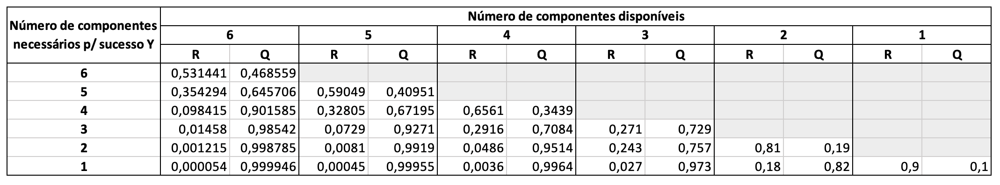

```{r setup, include=FALSE}
knitr::opts_chunk$set(echo = TRUE)
options(scipen=999)
```

```{r}
library(tidyverse)
library(MASS)
```


## Exercício 2 (página 6)
Sabe-se que em certo processo de fabricação existe uma fração de defeituosos de 1%. Se o consumidor padrão compra um lote com 50 produtos selecionados ao acaso, qual é a probabilidade de que receba no máximo 2 defeituosos?

### Solução:
O número de defeituosos, $Y$, presente no lote tem uma distribuição binomial com parâmetros $\theta = 0.01$ e $n = 50$, $Y \sim \mathcal{b}(n, \, \theta)$. 

Então, a função de probabilidade f.p. correspondente é:

$P(Y = y) = \dbinom{n}{y} \theta^y (1 - \theta)^{n - y}, y = 0,1,2 \ldots, n$

```{r}
q = 2
n = 50
p = 0.01

pbinom(q, n, p)
```

## Exercício 3 (página 6)

Na planta do exercício anterior existe uma política de troca-livre do produto defeituoso que é comprado. Se o custo de produção é de $\text{\$}10$ u. m. e o produto é vendido por $\text{\$}15$ u. m. qual o lucro que a planta tem por item vendido?

### Solução:

O item é perfeito ou defeituoso. A probabilidade de defeituoso é $\theta = 0,01$.

Assim, $X \sim \mathcal{b}(n, \, \theta)$, ou seja:

$$
X=
\begin{cases}
  1 \ \text{com}\ P(X = 1) = \theta \\
  0 \ \text{com}\ P(X = 0) = 1 - \theta
\end{cases}
$$

* O custo de produção é $\text{\$}10$;

* 1% da produção é defeituosa;

* Logo, o custo de produção considerando a probabilidade de defeito é $10 \times 1,01 = \text{\$}10,10$;

* O produto é vendido por $\text{\$}15$;

* Logo, o lucro por produto vendido é $15 - 10,10 = \text{\$}4,90$.


## Exercício 4 (página 6)

Considere um sistema composto por quatro (04) componentes. Estes componentes podem ser bombas de água em um sistema de engenharia mecânica, estruturas de suporte em um sistema de engenharia civil, transformadores de estação distribuidora em um sistema de potência, microprocessadores no controle de trocadores de calor em um sistema de engenharia química, entre outros. Portanto, embora o problema seja descrito em termos de casos específicos, ele pode representar uma vasta variedade de aplicações em engenharia. Considere os componentes idênticos e com uma probabilidade de desempenho sem falha de 0,9 e, ainda, independentes. Os estados existentes para os componentes são: S (desempenho sem falhas) e F (falha).

a) Escreva a expressão do número de combinações dos estados:

$(S_1 \cap S_2 \cap S_3 \cap S_4) \cup \\
(S_1 \cap S_2 \cap S_3 \cap F_4) \cup \\
(S_1 \cap S_2 \cap F_3 \cap S_4) \cup \\
(S_1 \cap S_2 \cap F_3 \cap F_4) \cup \\
(S_1 \cap F_2 \cap S_3 \cap S_4) \cup \\
(S_1 \cap F_2 \cap S_3 \cap F_4) \cup \\
(S_1 \cap F_2 \cap F_3 \cap S_4) \cup \\
(S_1 \cap F_2 \cap F_3 \cap F_4) \cup \\
(F_1 \cap S_2 \cap S_3 \cap S_4) \cup \\
(F_1 \cap S_2 \cap S_3 \cap F_4) \cup \\
(F_1 \cap S_2 \cap F_3 \cap S_4) \cup \\
(F_1 \cap S_2 \cap F_3 \cap F_4) \cup \\
(F_1 \cap F_2 \cap S_3 \cap S_4) \cup \\
(F_1 \cap F_2 \cap S_3 \cap F_4) \cup \\
(F_1 \cap F_2 \cap F_3 \cap S_4) \cup \\
(F_1 \cap F_2 \cap F_3 \cap F_4)$

b) Qual o número total de estados que o sistema pode assumir?

$S^4 +  4S^3F + 6S^2F^2 + 4SF^3 + F^4$

$1 + 4 + 6 + 4 + 1 = 16$

c) É possível escrever a expressão do item (a) como a potência de um binômio? Qual?

$\sum_{k=0}^{4} \dbinom{4}{k} F^n S^{n-k}$

$\dbinom{4}{0} F^n S^{n-0} + \dbinom{4}{1} F^n S^{n-1} + \dbinom{4}{2} F^n S^{n-2} + \dbinom{4}{3} F^n S^{n-3} + \dbinom{4}{4} F^n S^{n-4}$

$S^4 +  4S^3F + 6S^2F^2 + 4SF^3 + F^4$

d) Complete a tabela adiante:

| Estados do sistema | Probabilidade individual | 
| :------------- | :---------- | 
| 0 falhas | $P(S^4) = 0,9^4$| 
| 1 falha | $P(4S^3F) = 4 \times 0,9^3 \times 0,1$ | 
| 2 falhas | $P(6S^2F^2) = 6 \times 0,9^2 \times 0,1^2$| 
| 3 falhas | $P(4SF^3) = 4 \times 0,9 \times 0,1^3$ | 
| 4 falhas | $P(F^4) = 0,1^4$|

```{r}
falhas = 0:4
p_falha = 0.1
n = 4

for (x in falhas) {
  p = dbinom(x, n, p_falha)
  title = paste('Número de falhas:', x)
  lbl = paste0(title, ', probabilidade:', ' ', p)
  print(lbl)
}
```

## Exercício 5 (página 6)

No exercício 4 é assumido que quatro critérios de falha são considerados:

a) falha em um ou mais componentes derruba o sistema;

b) falha em dois ou mais componentes derruba o sistema;

c) falha em três ou mais componentes derruba o sistema;

d) falha dos quatro componentes derruba o sistema.

Então, pede-se:

1) qual a confiabilidade, R, do sistema com o critério b?

$R = P(Y \leq 1)$

$R = P[(Y=0) \cup (Y=1)]$

```{r}
p_falha = 0.1
n = 4
R = pbinom(q=1, n, p_falha)
print(paste('Confiabilidade R (probabilidade de ocorrer no máximo uma falha):', R))
```

2) qual a probabilidade de falha do sistema com o critério b?

$P(F) = 1 - R = P(Y \geq 2)$

```{r}
pf_b = 1 - R
print('Probabilidade de falha com o critério b:', pf_b)
```

3) Faça um Estudo de Sensibilidade preenchendo a tabela abaixo e considerando que cada casela deve receber na coluna R a $P(Y > y) = 1 – P(Y < y)$ e na coluna Q o complemento, ou seja, $P(Y < y)$.

```{r}
componentes = 1:6
p_sucesso = 0.9

for (c in componentes) {
  for (s in componentes) {
    if (s <= c) {
      R = dbinom(s, c, p_sucesso)
      Q = 1-R
      print(paste('Componentes disponíveis:', c))
      print(paste('Componentes necessários para o sucesso:', s))
      print(paste('R:', round(R, 6)))
      print(paste('Q:',round(Q, 6)))
      print(' ')
    }
  }
  print('---------------------------------------------------------')
}
```



# Exemplo (página 17)

```{r}
t = seq(0,40, length=1000)

fdp = dnorm(t, mean=20, sd=4) # f.d.p.

fd = pnorm(t, mean=20, sd=4) # f.d

R = 1 - fd # Confiabilidade

h = fdp / R # Risco

df = data.frame(t = t, fdp = fdp, fd = fd, R = R, h = h)

lbls = c('Função Densidade - N(20;4)', 'Função Distribuição - N(20;4)', 'Função Confiabilidade - N(20;4)', 'Função Risco - N(20;4)')

for (i in 1:length(lbls)) {
  title = lbls[i]
  col = colnames(df)[i+1]
  
  if (col != 't') {
    plt = ggplot(df, aes_string(x='t', y=col)) +
      geom_line(color='blue') +
      labs(title=title, x='t', y=col)
    print(plt)
  }
}

```

# Lista de Exercícios 1 (página 18)

1. Explique cada uma das curvas dos gráficos anteriores.

  + Gráfico da Função Confiabilidade:
  
  Este gráfico indica a probabilidade de um item sobreviver (não apresentar falhas) a um tempo superior a t. Neste gráfico, por exemplo, é possível observar que a probabilidade do item não apresentar falhas em um tempo t > 20 é de 50%.
  
  + Gráfico da Função Risco:
  
  Este gráfico indica a taxa condicional de falha. Ou seja, no exemplo em questão, a taxa condicional de falha de um item no tempo t = 25, dado que sobreviveu até o determinado instante, é aproximadamente 0,4.
  
  
2. Determine a função de confiabilidade, R(t), referente a dados modelados segundo a distribuição exponencial.

```{r}
t = seq(0,1.2, length=1000)

fd = pexp(t, rate = 5) # f.d

R = 1 - fd # Confiabilidade

df = data.frame(t = t, R = R)

ggplot(df, aes(x=t, y=R)) +
  geom_line(color='blue') +
  labs(x = 't', y = 'R', title='Função Confiabilidade - Distribuição Exponencial com parâmtro = 5')
```

8. Os dados a seguir correspondem aos tempos até a falha de determinado componente de um produto. Pede-se:


a) Faça os gráficos das funções: 
  + densidade de probabilidade f(t);
  + distribuição (acumulada) de probabilidade F(t);
  + confiabilidade R(t);
  + risco h(t).
  
A v.a. T, tempo até a falha, é contígua, logo tem uma f.d.p. Então, deve-se identificar a distribuição que melhor se ajusta aos dados, escolhendo a distribuição com maior p-valor.

```{r}
df_tempos = read.csv2("tempos_falha.csv", dec=",")
colnames(df_tempos) = 'T'


ggplot(df_tempos, aes(x = T)) +
  geom_histogram(color='blue', fill='blue', alpha=0.5, bins=18) +
  labs(y='Frqeuência')
```

```{r}
# Ajuste da distribuição de Weibull por máxima verossimilhança:

w_mle = fitdistr(x = df_tempos[,'T'], densfun = "weibull")

# estimativas:
print(w_mle)
```

```{r}
# Ajuste da distribuição de Exponencial por máxima verossimilhança:

e_mle = fitdistr(x = df_tempos[,'T'], densfun = "exponential")

# estimativas:
print(e_mle)
```

```{r}
# Ajuste da distribuição de Normal por máxima verossimilhança:

n_mle = fitdistr(x = df_tempos[,'T'], densfun = "normal")

# estimativas:
print(n_mle)
```

Teste de Kolmogorov-Smirnov:

```{r}
# Weibull
ks.test(df_tempos[,'T'], 'pweibull', shape=w_mle$estimate['shape'], scale=w_mle$estimate['scale'])

# Exponencial
ks.test(df_tempos[,'T'], 'pexp', rate=e_mle$estimate['rate'])

# Normal
ks.test(df_tempos[,'T'], 'pnorm', mean=n_mle$estimate['mean'], sd=n_mle$estimate['sd'])
```

Os dados analisados apresentaram maior aderência à distribuição de Weibull com parâmetros de forma = 1.8103710 e escala = 254.2696462, sendo o p-valor = 0.9848.

```{r}

t = seq(0,1000, length=100000)

fdp = dweibull(t, shape=1.8103710, scale=254.2696462) # f.d

fd = pweibull(t, shape=1.8103710, scale=254.2696462) # f.d

R = 1 - fd # Confiabilidade

h = fdp / R # Risco

df = data.frame(t = t, fdp = fdp, fd = fd, R = R, h = h)

lbls = c('Função Densidade (Weibull)', 'Função Distribuição (Weibull)', 'Função Confiabilidade (Weibull)', 'Função Risco (Weibull)')

for (i in 1:length(lbls)) {
  title = lbls[i]
  col = colnames(df)[i+1]
  
  if (col != 't') {
    plt = ggplot(df, aes_string(x='t', y=col)) +
      geom_line(color='blue') +
      labs(title=title, x='t', y=col)
    print(plt)
  }
}

```

9. Usando as estimativas dos parâmetros da Weibull, escreva os modelos estimados da função densidade de probabilidade (f.d.p.), função distribuição de probabilidade (f.d.), função de confiabilidade $R(t)$ e função de risco (taxa de falhas) $\lambda(t)$.

<br>

Parâmetro de forma: $\gamma = 1.8103710$

Parâmetro de escala: $\beta = 254.2696462$

<br>

Funcão distribuição:

$F(t; \gamma; \beta) = 1 - e^{-(t/\beta)^{\gamma}}, t \geq 0, \gamma, \beta \geq 0$

$F(t; \gamma; \beta) = 1 - e^{-(t/254.2696462)^{1.8103710}}$

<br>

Função densidade:

$f(t; \gamma; \beta) = \frac{\beta}{\gamma}(\frac{t}{\gamma})^{\beta-1} e^{-(t/\beta)^{\gamma}}, t \geq 0, \gamma, \beta \geq 0$

$f(t; \gamma; \beta) = \frac{254.2696462}{1.8103710}(\frac{t}{1.8103710})^{254.2696462-1} e^{-(t/254.2696462)^{1.8103710}}$

<br>

Função Confiabilidade:

$R(t) = 1 - F(t; \gamma; \beta)$

$R(t) = 1 - 1 - e^{-(t/\beta)^{\gamma}}$

$R(t) = - e^{-(t/\beta)^{\gamma}}$

$R(t) = - e^{-(t/254.2696462)^{1.8103710}}$

<br>

Função Risco:

$\lambda(t) = \dfrac{f(t; \gamma; \beta)}{R(t)}$

$\lambda(t) = \dfrac{\frac{\beta}{\gamma}(\frac{t}{\gamma})^{\beta-1} e^{-(t/\beta)^{\gamma}}}{ e^{-(t/\beta)^{\gamma}}}$

$\lambda(t) = \frac{\beta}{\gamma}(\frac{t}{\gamma})^{\beta-1}$


